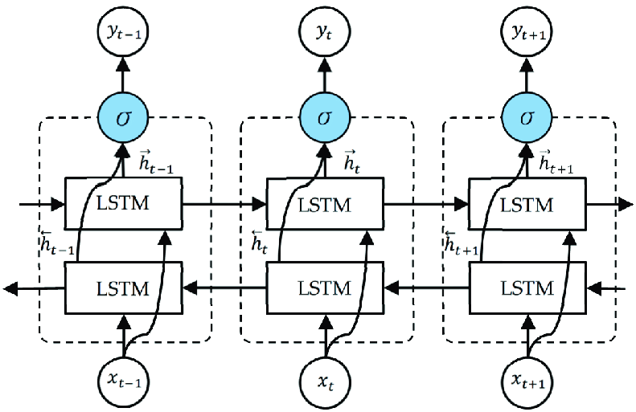

# Next-Word Generation Using Bi-Directional LSTM

## Introduction
This project aims to generate the next word in a sequence using the Bi-Directional LSTM (Long Short-Term Memory) architecture. The Bi-LSTM model is a powerful deep learning algorithm that has been widely used in natural language processing tasks, such as language translation, sentiment analysis, and text generation.

## Architecture
The Bi-Directional LSTM architecture consists of two LSTM layers: one that processes the input sequence in the forward direction, and another that processes it in the backward direction. This allows the model to capture both past and future context, making it highly effective for sequence generation tasks.

## Features
- Bidirectional processing: The model processes the input sequence in both forward and backward directions, capturing a comprehensive understanding of the context.
- Long Short-Term Memory: The LSTM layers enable the model to remember and utilize information from long sequences, making it suitable for generating coherent and contextually relevant next words.
- Deep learning: The model is built using deep learning techniques, allowing it to learn complex patterns and relationships in the input data.
- Titles Text into Sequences: Convert titles into sequences using a tokenizer or by manually separating each word. Assign each word a unique index in the lexicon.
- Generate n-grams: Create n-grams from the sequences, where an n-gram is a continuous run of n-title tokens.
- Count the Frequency: Determine the frequency of each n-gram in the dataset.
- Build the n-gram Model: Create the n-gram model using the n-gram frequencies. The model tracks the probability of each token given the previous n-1 tokens.
- Predict the Next Word: Use the n-gram model to predict the next token in an n-1-token sequence by finding the token with the highest probability.

## Usage
1. Install the required dependencies by running `pip install -r requirements.txt`.
2. Prepare your training data in a suitable format.
3. Run the `main.ipynb` to train the Bi-LSTM model.
4. Use the trained model to generate next words by running the `wordpred.py` script.
5. Also to look at the working deployed website [click here](https://next-word-generation-using-bi-directional-lstm-hxay7msbfsmlf3v.streamlit.app/)

## Results
The Bi-Directional LSTM model has shown promising results in generating accurate and contextually relevant next words. It has achieved a high level of fluency and coherence in the generated text, making it a valuable tool for various natural language processing applications.

## Contributing
Contributions are welcome! If you have any ideas or suggestions to improve this project, please feel free to submit a pull request.

## License
This project is licensed under the [MIT License](LICENSE).
